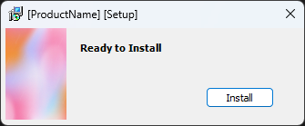
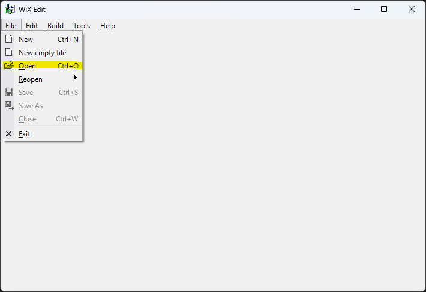
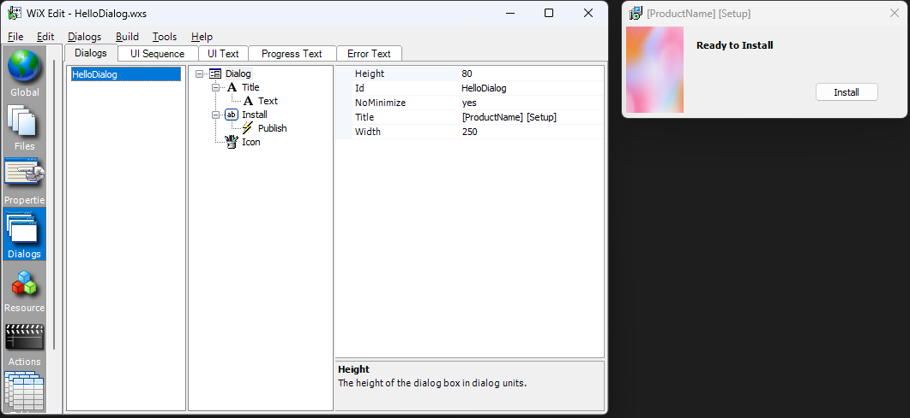

# Generating a Merge Module in WiX

## Merge Module Concept
Merge modules contains the necessary information to instal a subset of a software product. Whereas they do not force software designers to 
package a standalone feature within them, they would allow to it if that were intended. Based on that, merge modules could be considered an 
installation approximation to the concept of "encapsulation". 

As a recommendation in the humble opinion of this software developer, a merge module should be self-containing in the sence of not depending
on an external features. Avoiding merge module interdependencies contributes to keep the installation design simple. Designing merge modules
that way is the choice of the installation design, however it is encouraged: *A feature has a dependency on a merge module, not the other way
around.* [6]

This example is intended to show how merge modules can be used to encapsulate a software piece and it leves to the reader deciding how that 
could become a solution.


## Example Description
It follows the steps listed below to have a clean merge module definition. All of them are detailed in the WiX Toolset documentation [1].
Md Khadeer explains how to create a merge modue using visual studio [5] reading it is highly recommended.

### 1. Define the directory structure: 
Intended to clearly define the directory structure that will be used within the merge module. Directories are relative to the installation 
directory specified in the [MSI project](InstallerMsi), see [MergeModule.wxs](MergeModule.wxs).
```xml
    <!--
    *
    * Step 1: Define the directory structure
    *==========================================================================
    Directory 'Id' is an arbitrary identifier given for later use in
    the WiX project. Ids should be different since they hold independent 
    directories.
    -->
    <Directory Id="TARGETDIR" Name="SourceDir">
      <Directory Id="ABCMM_APP_ROOT_DIRECTORY" Name="abc">

        <Directory Id="BINARIES" Name="bin">
        </Directory>

        <Directory Id="DOCUMENTATION" Name="docs">
          <Directory Id="LICENSE" Name="license"> <!-- sub-directory -->
            <!-- Points to [MSI Install Directory]\abc\docs\license. -->
          </Directory>
        </Directory>
        
      </Directory>
    </Directory>
```

### 2. Add files to your installer package
Restrict to a single file per component and every component must have its own unique GUID; Visual Studio, generally located under 
`Tools > Create GUID menu`, or the [https://www.guidgen.com/](https://www.guidgen.com/) site, see [MergeModule.wxs](MergeModule.wxs).
```xml
   <!--
    *
    * Step 2: Add files to your installer package
    *==========================================================================
    File 'Id' can be the same file name or a more descriptive id, as well.
    Component Ids should be different since they represent independent 
    installation entities.
    -->
    <DirectoryRef Id="DOCUMENTATION">
      <Component Id="AbcTxtComponent" Guid="{6B487838-94A7-4546-A92E-8CD6C7BE2C53}">
        <File 
          Id="readme_file" 
          Name="abc.txt" 
          Source="install\nested_abc.txt" 
          KeyPath="yes" />
        <!--'KeyPath' attribute set to yes requests WiX to test whether 
        component is installed.-->
      </Component>
    </DirectoryRef>
```

### 3. Tell Windows Installer to install the files
Installing files is done in the MSI project and it is associated to the merge module by using the `Merge` tag. The following example
shows a way in which that can be done, see [InstallerMsi/Product.wxs](https://github.com/axelgafu/WinInstallX/blob/master/InstallerMsi/Product.wxs). 
Notice that file is part of a different project in the installer solution:
```xml
<?xml version="1.0" encoding="utf-8"?>
<Wix xmlns="http://schemas.microsoft.com/wix/2006/wi">
  <Product 
    Name="SampleInstaller" 
    Manufacturer="axelgafu" 
    >
    
    <!-- Several lines were removed in this code snippet -->
    
    <!--
    *
    * Step 3: Tell Windows Installer to install the files
    *==========================================================================
    TARGETDIR is the parent structure. It holds the directory structure of the
    windows installer (MSI) project; there is no directory mapping in it yet.
    -->
    <Directory Id="TARGETDIR" Name="SourceDir">
      <Directory Id="ProgramFilesFolder"><!--Points to C:\Program Files-->
        <Directory Id="MANUFACTURERDIR" Name="!(bind.property.Manufacturer)">
          <Directory Id="PRODUCTDIR" Name="!(bind.property.ProductName)">
            <Merge Id="InteractiveMM" Language="1033" 
                   SourceFile="..\InteractiveMM\bin\Release\InteractiveMM.msm" DiskId="1" />
          </Directory>
        </Directory>
      </Directory>
    </Directory>
    
    
    <Feature Id="AbcFeature" Title="Interactive Merge Module" Level="1">      
      <MergeRef Id="InteractiveMM" />
    </Feature>

    <!-- Several lines were removed in this code snippet -->

  </Product>
</Wix>
```
The `Merge` tag requires to be used inside of a directory declaration [3]. It will take its root directory defintion from the `Directory`
tag where it is located; in this example the **MSI Install Directory** corresponds to `C:\Program Files\[bind.property.Manufacturer]\[bind.property.ProductName]`
which in turn evaluates to `C:\Program Files\axelgafu\SampleInstaller` ---The !(bind.) syntax is documented in the Linker (light) topic in WiX.chm [4].

The merge module is invoked by the `Feature`tag at the bottom of the code snippet above. 

# Graphical Interface
WiX has a base library for graphical interfaces and it is intended for simple dialogs.

## WiX Edit Tool
Creating graphical interfaces using XML can be assisted by using tools like [WiX Edit](https://wixedit.github.io/) [1]. There seems not to be a tutorial for
that tool, however, it is fairy intuitive. Besides that, any doubt about the WiX options can be consulted in the official [WixUI Dialog Library](https://wixtoolset.org/docs/v3/wixui/).
If creating a custom dialog is necessary, the topic of interest most likely is "Customizing Built-in WixUI Dialog Sets". There is a list of available dialogs
in the "WixUI Dialogs" topic of the documentation.

### Example







# References
1. WiX Toolset, "How To: Add a File To Your Installer", wixtoolset.org, accessed 2022/01/14, [https://wixtoolset.org/docs/v3/howtos/files_and_registry/add_a_file/](https://wixtoolset.org/docs/v3/howtos/files_and_registry/add_a_file/)
2. WiX Toolset, "How To: Generate a GUID", wixtoolset.org, accessed 2022/01/14, [https://wixtoolset.org/docs/v3/howtos/general/generate_guids/](https://wixtoolset.org/docs/v3/howtos/general/generate_guids/)
3. WiX Toolset, "Merge Element", wixtoolset.org, accessed 2022/01/14, [https://wixtoolset.org/docs/v3/xsd/wix/merge/](https://wixtoolset.org/docs/v3/xsd/wix/merge/)
4. Stackoverflow, "Wix Installer - how can I show the value of [Manufacturer] in the install path?", stackoverflow.com, accessed 2022/01/15, [https://stackoverflow.com/questions/16946701/wix-installer-how-can-i-show-the-value-of-manufacturer-in-the-install-path](https://stackoverflow.com/questions/16946701/wix-installer-how-can-i-show-the-value-of-manufacturer-in-the-install-path)
5. Khadeer Md, "Wix Creating Merge Modules MSM and MSI.", medium.com, 2019/07/15,  [https://medium.com/@kmdkhadeer/wix-creating-merge-modules-msm-and-msi-354fdd29a26e](https://medium.com/@kmdkhadeer/wix-creating-merge-modules-msm-and-msi-354fdd29a26e)
6. Stackoverflow, "Howto use configurable Merge Modules in Wix?", stackoverflow.com, accessed 2022/01/15, [https://stackoverflow.com/questions/2091724/howto-use-configurable-merge-modules-in-wix](https://stackoverflow.com/questions/2091724/howto-use-configurable-merge-modules-in-wix)
7. GitHub, "WixEdit", wixedit.github.io, accessed 2023/01/17, [https://wixedit.github.io/](https://wixedit.github.io/)

